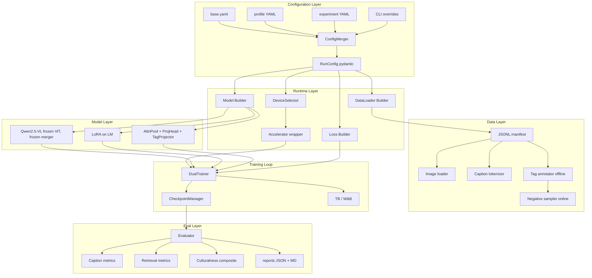

# Formosa-VLM Dual-Objective Alignment — Software Construction Spec

**Project**: `formosa-dual`
**Spec version**: v2.0 (agent-targeted)
**Owner**: Ren-He Huang (黃仁和)
**Companion**: `FORMOSA_VLM_DUAL_OBJECTIVE_SPEC.md` (research design)

---

## §0. AGENT DIRECTIVE — READ THIS FIRST

You are an AI coding agent. Your task is to **construct the entire `formosa-dual` codebase from this spec in a single session**. This document is your construction contract.

### §0.1 How to read this spec

1. Read **§0 (this section)**, **§1 (non-negotiables)**, and **§2 (architecture)** in full before writing any code.
2. Then implement in the order given by **§14 (construction order)**.
3. After each phase, run the verification commands in that phase before moving on.
4. When this spec is ambiguous on a point, follow the priorities in §0.5 below.

### §0.2 What you MUST do

- Implement **every** module, script, config, and test listed.
- Use **exactly** the file paths, module names, class names, function signatures, and CLI argument names given in this spec.
- Use **exactly** the libraries and versions in `requirements/*.txt`.
- Make every script verifiable: produce a structured exit code, log structured output, and either succeed clearly or fail with a clear error.
- Make the codebase runnable in two environments (Mac MPS smoke test, GB10 CUDA production) using the same code path.

### §0.3 What you MUST NOT do

The following are anti-patterns that AI agents commonly produce. **Do not do any of them.**

- ❌ Do not invent CLI flags or config keys not listed in this spec.
- ❌ Do not introduce libraries beyond what `requirements/*.txt` specifies.
- ❌ Do not "refactor for clarity" or rename files. The layout is fixed.
- ❌ Do not combine modules. Each file in §3 exists for a reason.
- ❌ Do not hardcode values that this spec marks as configurable.
- ❌ Do not skip writing tests. Every module in §6 has tests in §11.
- ❌ Do not add a "main" entrypoint other than `train_dual.py`.
- ❌ Do not commit model weights, datasets, `.env`, or HF tokens. `.gitignore` rules apply.
- ❌ Do not silently catch exceptions. Use structured logging and re-raise where the spec says raise.
- ❌ Do not use `print()` for logging. Use the logger from `formosa_dual.utils.logging`.
- ❌ Do not generate docstrings that contradict spec behavior. If you can't fulfill a docstring, raise `NotImplementedError` with a clear message.
- ❌ Do not add streamlit / fastapi / serving code unless this spec explicitly requests it. (It does not.)
- ❌ Do not "improve" the loss formulation, architecture, or training loop based on your own judgment. The design is fixed by the research spec.

### §0.4 What is OK to add

You may add (without asking):

- Type hints (even where this spec omitted them in prose for brevity).
- Logging statements at INFO level for operational events.
- Defensive assertions on tensor shapes, dtype, device.
- Inline comments where the implementation is non-obvious.
- Standard Python boilerplate: `__init__.py`, `__all__`, `__version__`.
- README files inside subdirectories that summarize that subdirectory.

### §0.5 Handling ambiguity

If this spec does not specify something, follow this priority order:

1. **Sensible PyTorch / HuggingFace default**: e.g., if dropout in some sub-module is not specified, use 0.0.
2. **Match the pattern of similar specified items**: e.g., if `lr_aux` is specified but `lr_aux_layer_norm` is not, use `lr_aux`.
3. **Document the assumption**: add a comment in the relevant code: `# ASSUMPTION: not specified in spec; using X because Y`.
4. **Do not pause to ask the user.** This is a single-session build. Ship working code with documented assumptions.

### §0.6 Definition of Done

You are done when **all of the following pass on the developer's Mac**:

```bash
# 1. Environment verification exits 0
python scripts/verify_environment.py

# 2. All unit tests pass
pytest tests/unit/ -v

# 3. All integration tests pass
pytest tests/integration/ -v

# 4. The fastest smoke test passes in <60s
pytest tests/smoke/test_smoke_mac_synthetic.py -v

# 5. The full Mac smoke test passes in <15min
python train_dual.py --profile dev_mac --experiment v3_hero --smoke

# 6. Config dry-runs work for every experiment
for exp in v0_zero_shot v1_caption_only v2_contrast_only v3_hero v4_curriculum v5_hard_neg; do
    python train_dual.py --profile dev_mac --experiment $exp --dry-run
done
```

If all six pass, the codebase is shippable. The user will then deploy to GB10 separately.

---

## §1. NON-NEGOTIABLES

The following are fixed and not subject to alternative implementations:

| Item | Value |
|---|---|
| Backbone (production) | `Qwen/Qwen2.5-VL-7B-Instruct` |
| Backbone (Mac dev) | `Qwen/Qwen2.5-VL-3B-Instruct` |
| Tag embedding init | Chinese-CLIP (`OFA-Sys/chinese-clip-vit-base-patch16`), frozen base + trainable projector |
| LoRA targets | `q_proj, k_proj, v_proj, o_proj, gate_proj, up_proj, down_proj` on LM only |
| ViT freeze | Frozen by default. `unfreeze_vit_last_n` is the only configurable lever. |
| Vision-LM merger | Frozen. Always. |
| Loss composition | `L = L_caption + λ(t) · L_contrast`. Single forward pass. No alternating training. |
| Contrastive loss | Multi-positive InfoNCE with τ=0.07 default. |
| λ default | 0.2 with warmup over first 10% of steps. |
| Tag vocab default size | 800 |
| Negatives per image default | 256 |
| Projection dim | 256 |
| Attention pool num_heads | 8 |
| Pooler hidden | 1024 (in projection MLP) |
| Optimizer | AdamW (β1=0.9, β2=0.95, ε=1e-8). 8-bit variant only on GB10. |
| Mixed precision | bf16 on both Mac and GB10 |
| Gradient checkpointing | Always on |
| Single entrypoint | `train_dual.py` |
| Config priority | base.yaml < profile/*.yaml < experiment/*.yaml < CLI overrides |
| Manifest format | JSONL, one record per line, schema in §5.3.1 |
| Splits group key | `article_url` |
| Dedup signals | `image_hash` + perceptual hash (Hamming<8) + CLIP cos>0.95 |

---

## §2. System Architecture



**Architectural invariants**:

1. **One entrypoint**: `train_dual.py` is the only training entry. There is no alternative.
2. **Config-driven**: every behavior difference (Mac vs GB10, V1 vs V3, hero vs ablation) is a config change. No code branches on profile name.
3. **Device-agnostic**: code uses `tensor.to(device)`, never `.cuda()` or `.mps()` directly.
4. **Modular losses**: caption and contrastive losses are independent modules composed by `DualObjectiveLoss`.
5. **Asymmetric gradient flow**: contrastive loss gradients flow to visual-side modules only; caption loss gradients flow to LM LoRA + visual-side modules. This is intentional. Do not change it.

---

## §3. Repository Layout (EXACT)

Create exactly this layout. File names, directory names, and module paths are not flexible.

```
formosa-dual/
├── README.md
├── pyproject.toml
├── requirements/
│   ├── base.txt
│   ├── mac.txt
│   └── gb10.txt
├── .python-version                         # 3.11
├── .gitignore
│
├── configs/
│   ├── base.yaml
│   ├── profiles/
│   │   ├── dev_mac.yaml
│   │   ├── dev_smoke.yaml
│   │   └── prod_gb10.yaml
│   └── experiments/
│       ├── v0_zero_shot.yaml
│       ├── v1_caption_only.yaml
│       ├── v2_contrast_only.yaml
│       ├── v3_hero.yaml
│       ├── v4_curriculum.yaml
│       ├── v5_hard_neg.yaml
│       └── ablations/
│           ├── lambda_0.0.yaml
│           ├── lambda_0.1.yaml
│           ├── lambda_0.3.yaml
│           ├── lambda_0.5.yaml
│           ├── tau_0.05.yaml
│           ├── tau_0.10.yaml
│           ├── vocab_tier1.yaml
│           ├── neg_hard.yaml
│           └── unfreeze_vit.yaml
│
├── src/formosa_dual/
│   ├── __init__.py
│   ├── version.py
│   ├── config/
│   │   ├── __init__.py
│   │   ├── schema.py
│   │   ├── loader.py
│   │   └── validation.py
│   ├── data/
│   │   ├── __init__.py
│   │   ├── manifest.py
│   │   ├── dataset.py
│   │   ├── tag_annotator.py
│   │   ├── tag_vocab.py
│   │   ├── splits.py
│   │   ├── collator.py
│   │   └── negative_sampler.py
│   ├── models/
│   │   ├── __init__.py
│   │   ├── backbone.py
│   │   ├── attention_pooler.py
│   │   ├── projection_head.py
│   │   ├── tag_projector.py
│   │   ├── lora_config.py
│   │   └── dual_model.py
│   ├── losses/
│   │   ├── __init__.py
│   │   ├── caption_loss.py
│   │   ├── multi_pos_infonce.py
│   │   ├── lambda_schedule.py
│   │   └── dual_objective.py
│   ├── training/
│   │   ├── __init__.py
│   │   ├── device.py
│   │   ├── accelerator.py
│   │   ├── trainer.py
│   │   ├── checkpoint.py
│   │   └── callbacks.py
│   ├── eval/
│   │   ├── __init__.py
│   │   ├── caption_metrics.py
│   │   ├── retrieval_metrics.py
│   │   ├── culturalness.py
│   │   ├── nli_factuality.py
│   │   ├── chair_pope.py
│   │   └── reporter.py
│   └── utils/
│       ├── __init__.py
│       ├── logging.py
│       ├── seeding.py
│       ├── timing.py
│       └── synthetic.py
│
├── scripts/
│   ├── verify_environment.py
│   ├── build_tag_vocab.py
│   ├── annotate_tags.py
│   ├── audit_annotations.py
│   ├── build_splits.py
│   ├── make_synthetic_data.py
│   └── download_models.py
│
├── train_dual.py
│
├── eval/
│   ├── zero_shot.py
│   ├── run_all_metrics.py
│   └── retrieval_only.py
│
├── tests/
│   ├── __init__.py
│   ├── conftest.py
│   ├── unit/
│   │   ├── __init__.py
│   │   ├── test_config_loader.py
│   │   ├── test_tag_annotator.py
│   │   ├── test_negative_sampler.py
│   │   ├── test_attention_pooler.py
│   │   ├── test_projection_head.py
│   │   ├── test_multi_pos_infonce.py
│   │   ├── test_lambda_schedule.py
│   │   └── test_culturalness.py
│   ├── integration/
│   │   ├── __init__.py
│   │   ├── test_dataset_pipeline.py
│   │   ├── test_dual_model_forward.py
│   │   ├── test_trainer_one_step.py
│   │   └── test_checkpoint_roundtrip.py
│   └── smoke/
│       ├── __init__.py
│       ├── test_smoke_mac_synthetic.py
│       └── test_smoke_mac_3b.py
│
├── data/                                   # gitignored
│   └── .gitkeep
├── outputs/                                # gitignored
│   └── .gitkeep
└── docs/
    ├── runbook_mac.md
    ├── runbook_gb10.md
    ├── config_reference.md
    └── failure_modes.md
```

### §3.1 `.gitignore` (exact contents)

```gitignore
# Python
__pycache__/
*.py[cod]
*$py.class
*.so
.Python
.venv/
venv/
.pytest_cache/
.mypy_cache/
.coverage
htmlcov/
*.egg-info/
build/
dist/

# Project artifacts
data/
!data/.gitkeep
outputs/
!outputs/.gitkeep
*.ckpt
*.safetensors
*.bin
wandb/
runs/

# Secrets
.env
.env.*
!.env.example
*.token

# IDE
.vscode/
.idea/
*.swp
.DS_Store

# Notebooks
.ipynb_checkpoints/
```

### §3.2 `pyproject.toml` (exact contents)

```toml
[build-system]
requires = ["setuptools>=68", "wheel"]
build-backend = "setuptools.build_meta"

[project]
name = "formosa-dual"
version = "0.1.0"
description = "Formosa-VLM dual-objective alignment: caption SFT + cultural contrastive auxiliary"
readme = "README.md"
requires-python = ">=3.11"
license = { text = "Apache-2.0" }
authors = [{ name = "Ren-He Huang" }]

[project.optional-dependencies]
dev = ["pytest>=8.0", "pytest-cov>=5.0", "ruff>=0.6", "black>=24.0"]

[tool.setuptools.packages.find]
where = ["src"]

[tool.ruff]
line-length = 100
target-version = "py311"

[tool.pytest.ini_options]
testpaths = ["tests"]
python_files = ["test_*.py"]
markers = [
    "slow: tests that take >10s",
    "gpu: tests requiring CUDA",
    "smoke: smoke tests for end-to-end verification",
]
```

---

## §4. Configuration System

The configuration system is the **single most important abstraction**. Implement it exactly as specified.

### §4.1 Pydantic schema (`src/formosa_dual/config/schema.py`)

Implement every class with every field shown. Defaults are exact.

```python
from pydantic import BaseModel, Field, field_validator, model_validator
from typing import Literal, Optional


class ModelConfig(BaseModel):
    name: str = "Qwen/Qwen2.5-VL-7B-Instruct"
    revision: Optional[str] = None
    torch_dtype: Literal["bf16", "fp16", "fp32"] = "bf16"
    attn_implementation: Literal["sdpa", "flash_attention_2", "eager"] = "sdpa"
    freeze_vit: bool = True
    freeze_merger: bool = True
    unfreeze_vit_last_n: int = 0


class LoRAConfig(BaseModel):
    enabled: bool = True
    r: int = 32
    alpha: int = 64
    dropout: float = 0.05
    target_modules: list[str] = [
        "q_proj", "k_proj", "v_proj", "o_proj",
        "gate_proj", "up_proj", "down_proj",
    ]
    bias: Literal["none", "all", "lora_only"] = "none"


class AuxModulesConfig(BaseModel):
    proj_dim: int = 256
    pooler_type: Literal["mean", "attention"] = "attention"
    pooler_num_heads: int = 8
    proj_hidden: int = 1024
    tag_init: Literal["random", "lm_token_avg", "chinese_clip"] = "chinese_clip"
    chinese_clip_model: str = "OFA-Sys/chinese-clip-vit-base-patch16"
    freeze_tag_base: bool = True


class ContrastiveConfig(BaseModel):
    enabled: bool = True
    lambda_value: float = 0.2
    lambda_schedule: Literal["constant", "warmup", "warmup_anneal"] = "warmup"
    lambda_warmup_ratio: float = 0.1
    lambda_anneal_ratio: float = 0.0
    lambda_floor: float = 0.0
    tau: float = 0.07
    negatives_per_image: int = 256
    neg_sampling: Literal["uniform", "inverse_freq", "hard"] = "uniform"
    hard_neg_refresh_every_steps: int = 200


class CaptionConfig(BaseModel):
    enabled: bool = True
    max_caption_tokens: int = 384
    label_smoothing: float = 0.0


class DataConfig(BaseModel):
    train_manifest: str
    val_manifest: str
    test_manifests: dict[str, str] = {}
    vocab_path: str
    image_root: str
    max_pixels: int = 802816                # 1024*28*28
    min_pixels: int = 200704                # 256*28*28
    num_workers: int = 4
    pin_memory: bool = True
    curriculum: Optional[dict] = None        # populated only by V4


class OptimConfig(BaseModel):
    lr_lora: float = 2e-4
    lr_aux: float = 1e-3
    weight_decay_lora: float = 0.0
    weight_decay_aux: float = 0.05
    weight_decay_tag_proj: float = 0.1
    optimizer: Literal["adamw", "adamw_8bit"] = "adamw"
    scheduler: Literal["cosine", "linear", "constant_with_warmup"] = "cosine"
    warmup_ratio: float = 0.05
    adam_beta1: float = 0.9
    adam_beta2: float = 0.95
    adam_epsilon: float = 1e-8
    max_grad_norm: float = 1.0


class TrainingConfig(BaseModel):
    num_epochs: int = 3
    per_device_batch_size: int = 2
    gradient_accumulation_steps: int = 16
    gradient_checkpointing: bool = True
    seed: int = 42
    eval_steps: int = 500
    save_steps: int = 1000
    logging_steps: int = 20
    save_total_limit: int = 3
    early_stopping_patience: int = 0


class DeviceConfig(BaseModel):
    auto_detect: bool = True
    force: Optional[Literal["cuda", "mps", "cpu"]] = None
    mixed_precision: Literal["bf16", "fp16", "no"] = "bf16"


class LoggingConfig(BaseModel):
    backend: Literal["wandb", "tensorboard", "none"] = "tensorboard"
    project: str = "formosa-dual"
    run_name: Optional[str] = None
    output_dir: str = "outputs/default"


class SmokeConfig(BaseModel):
    enabled: bool = False
    max_train_samples: int = 16
    max_eval_samples: int = 8
    max_steps: int = 5
    max_pixels_override: Optional[int] = 200704
    max_caption_tokens_override: Optional[int] = 64
    skip_eval: bool = False


class RunConfig(BaseModel):
    profile: Literal["dev_mac", "dev_smoke", "prod_gb10"] = "prod_gb10"
    experiment: str = "v3_hero"

    model: ModelConfig
    lora: LoRAConfig
    aux: AuxModulesConfig
    contrastive: ContrastiveConfig
    caption: CaptionConfig
    data: DataConfig
    optim: OptimConfig
    training: TrainingConfig
    device: DeviceConfig
    logging: LoggingConfig
    smoke: SmokeConfig = SmokeConfig()

    @model_validator(mode="after")
    def at_least_one_loss_enabled(self):
        if not self.contrastive.enabled and not self.caption.enabled:
            raise ValueError("At least one of caption/contrastive must be enabled")
        return self
```

### §4.2 Config loader (`src/formosa_dual/config/loader.py`)

Implement `load_config()` with this exact signature and behavior.

```python
def load_config(
    profile: str,
    experiment: str,
    cli_overrides: list[str] | None = None,
    smoke: bool = False,
    base_path: Path = Path("configs"),
) -> RunConfig:
    """
    Load and merge configs in priority order (right wins, deep-merged):
        base.yaml < profiles/{profile}.yaml < experiments/{experiment}.yaml < cli_overrides

    cli_overrides format: list of "key.subkey=value" strings.
    Values parsed as YAML (so "0.5" → float, "true" → bool, "[a,b]" → list).

    smoke=True forces smoke.enabled=True regardless of any config file.

    Returns a validated RunConfig instance.
    Raises ConfigError on:
        - missing files
        - unknown keys in YAML or overrides
        - schema violations
    """
```

Helper rules:

- Use `yaml.safe_load`. Never `yaml.load`.
- Deep-merge dicts. For lists, right-side replaces left-side entirely (do not concat).
- Detect unknown keys by parsing into pydantic with `extra="forbid"` — raise on unknown.
- CLI override `key.subkey=value` updates nested dicts before pydantic validation.

### §4.3 Config files (exact contents required)

#### `configs/base.yaml`

```yaml
profile: prod_gb10
experiment: v3_hero

model:
  name: Qwen/Qwen2.5-VL-7B-Instruct
  torch_dtype: bf16
  attn_implementation: sdpa
  freeze_vit: true
  freeze_merger: true
  unfreeze_vit_last_n: 0

lora:
  enabled: true
  r: 32
  alpha: 64
  dropout: 0.05
  target_modules: [q_proj, k_proj, v_proj, o_proj, gate_proj, up_proj, down_proj]
  bias: none

aux:
  proj_dim: 256
  pooler_type: attention
  pooler_num_heads: 8
  proj_hidden: 1024
  tag_init: chinese_clip
  chinese_clip_model: OFA-Sys/chinese-clip-vit-base-patch16
  freeze_tag_base: true

contrastive:
  enabled: true
  lambda_value: 0.2
  lambda_schedule: warmup
  lambda_warmup_ratio: 0.1
  lambda_anneal_ratio: 0.0
  lambda_floor: 0.0
  tau: 0.07
  negatives_per_image: 256
  neg_sampling: uniform
  hard_neg_refresh_every_steps: 200

caption:
  enabled: true
  max_caption_tokens: 384
  label_smoothing: 0.0

data:
  train_manifest: data/splits/train.jsonl
  val_manifest: data/splits/dev.jsonl
  test_manifests:
    test_id: data/splits/test_id.jsonl
    test_source_holdout: data/splits/test_source_holdout.jsonl
    test_cultural_hard: data/splits/test_cultural_hard.jsonl
  vocab_path: data/vocab/vocab_T_v1.json
  image_root: data/raw/images
  max_pixels: 802816
  min_pixels: 200704
  num_workers: 4
  pin_memory: true

optim:
  lr_lora: 0.0002
  lr_aux: 0.001
  weight_decay_lora: 0.0
  weight_decay_aux: 0.05
  weight_decay_tag_proj: 0.1
  optimizer: adamw
  scheduler: cosine
  warmup_ratio: 0.05
  adam_beta1: 0.9
  adam_beta2: 0.95
  adam_epsilon: 1.0e-8
  max_grad_norm: 1.0

training:
  num_epochs: 3
  per_device_batch_size: 2
  gradient_accumulation_steps: 16
  gradient_checkpointing: true
  seed: 42
  eval_steps: 500
  save_steps: 1000
  logging_steps: 20
  save_total_limit: 3
  early_stopping_patience: 0

device:
  auto_detect: true
  force: null
  mixed_precision: bf16

logging:
  backend: tensorboard
  project: formosa-dual
  run_name: null
  output_dir: outputs/default
```

#### `configs/profiles/dev_mac.yaml`

```yaml
model:
  name: Qwen/Qwen2.5-VL-3B-Instruct
  attn_implementation: sdpa
  torch_dtype: bf16

data:
  num_workers: 2
  max_pixels: 200704

training:
  per_device_batch_size: 1
  gradient_accumulation_steps: 4
  gradient_checkpointing: true

device:
  force: mps
  mixed_precision: bf16

logging:
  backend: tensorboard

smoke:
  enabled: true
  max_train_samples: 32
  max_eval_samples: 8
  max_steps: 10
  max_caption_tokens_override: 64
  max_pixels_override: 200704
```

#### `configs/profiles/dev_smoke.yaml`

```yaml
model:
  name: Qwen/Qwen2.5-VL-3B-Instruct
  attn_implementation: sdpa

data:
  train_manifest: data/synthetic/train_synth.jsonl
  val_manifest: data/synthetic/val_synth.jsonl
  vocab_path: data/synthetic/vocab_synth.json
  image_root: data/synthetic/images
  num_workers: 0
  max_pixels: 50176

training:
  per_device_batch_size: 1
  gradient_accumulation_steps: 1
  num_epochs: 1
  eval_steps: 2
  save_steps: 3
  logging_steps: 1

device:
  force: mps
  mixed_precision: "no"

smoke:
  enabled: true
  max_train_samples: 8
  max_eval_samples: 4
  max_steps: 3
  max_caption_tokens_override: 32
  max_pixels_override: 50176
```

#### `configs/profiles/prod_gb10.yaml`

```yaml
model:
  name: Qwen/Qwen2.5-VL-7B-Instruct
  attn_implementation: flash_attention_2
  torch_dtype: bf16

data:
  num_workers: 8
  max_pixels: 802816

training:
  per_device_batch_size: 2
  gradient_accumulation_steps: 16
  gradient_checkpointing: true

device:
  force: cuda
  mixed_precision: bf16

logging:
  backend: wandb
  output_dir: outputs

smoke:
  enabled: false
```

#### `configs/experiments/v0_zero_shot.yaml`

```yaml
# V0 is evaluated via eval/zero_shot.py, not train_dual.py.
# This config exists only for --dry-run validation completeness.
caption:
  enabled: false
contrastive:
  enabled: false
training:
  num_epochs: 0
logging:
  run_name: v0_zero_shot
  output_dir: outputs/v0_zero_shot
```

Note: this config will fail the `at_least_one_loss_enabled` validator. Override the validator in `train_dual.py` only when `--dry-run` is passed for v0 specifically — log a warning instead of raising.

#### `configs/experiments/v1_caption_only.yaml`

```yaml
contrastive:
  enabled: false
  lambda_value: 0.0
caption:
  enabled: true
logging:
  run_name: v1_caption_only
  output_dir: outputs/v1_caption_only
```

#### `configs/experiments/v2_contrast_only.yaml`

```yaml
caption:
  enabled: false
contrastive:
  enabled: true
  lambda_value: 1.0
training:
  num_epochs: 5
logging:
  run_name: v2_contrast_only
  output_dir: outputs/v2_contrast_only
```

#### `configs/experiments/v3_hero.yaml`

```yaml
contrastive:
  enabled: true
  lambda_value: 0.2
  lambda_schedule: warmup
  lambda_warmup_ratio: 0.1
  tau: 0.07
caption:
  enabled: true
logging:
  run_name: v3_hero
  output_dir: outputs/v3_hero
```

#### `configs/experiments/v4_curriculum.yaml`

```yaml
# Inherits v3_hero config plus difficulty curriculum
contrastive:
  enabled: true
  lambda_value: 0.2
caption:
  enabled: true
data:
  curriculum:
    enabled: true
    schedule:
      - {phase: warm_start,   max_difficulty: 2, sampling_weight: 1.0, ratio: 0.20}
      - {phase: expansion,    max_difficulty: 3, sampling_weight: 1.0, ratio: 0.20}
      - {phase: hardening,    max_difficulty: 4, sampling_weight: 1.2, ratio: 0.20}
      - {phase: cultural_peak,max_difficulty: 5, sampling_weight: 1.5, ratio: 0.20}
      - {phase: consolidation,max_difficulty: 5, sampling_weight: 1.0, ratio: 0.20}
logging:
  run_name: v4_curriculum
  output_dir: outputs/v4_curriculum
```

#### `configs/experiments/v5_hard_neg.yaml`

```yaml
contrastive:
  enabled: true
  lambda_value: 0.2
  neg_sampling: hard
  hard_neg_refresh_every_steps: 200
caption:
  enabled: true
logging:
  run_name: v5_hard_neg
  output_dir: outputs/v5_hard_neg
```

#### `configs/experiments/ablations/*.yaml`

For each ablation file, only the changed key needs to be present. The `run_name` and `output_dir` in `logging` must match the file name.

Example `lambda_0.5.yaml`:

```yaml
contrastive:
  enabled: true
  lambda_value: 0.5
caption:
  enabled: true
logging:
  run_name: ablation_lambda_0.5
  output_dir: outputs/ablation_lambda_0.5
```

Generate the remaining ablation files by analogy.

---

## §5. Module Specifications

For each module: implement the public API exactly as specified. You may add private helpers (prefix with underscore).

### §5.1 `formosa_dual.utils.logging`

```python
def get_logger(name: str = "formosa_dual") -> logging.Logger:
    """
    Return a logger configured with:
      - level: INFO from env FORMOSA_LOG_LEVEL, default INFO
      - format: "[{asctime}] {levelname} {name}: {message}"
      - stream: stderr
      - one handler maximum (idempotent)
    """
```

All other modules MUST use this logger. No `print()` statements except in CLI scripts for user-facing output.

### §5.2 `formosa_dual.utils.seeding`

```python
def set_seed(seed: int) -> None:
    """Seed: random, numpy, torch (cpu + all gpus + mps)."""
```

### §5.3 `formosa_dual.training.device`

Implement these functions exactly:

```python
import torch
from typing import Literal


def select_device(cfg) -> torch.device:
    """
    If cfg.force is set: return torch.device(cfg.force).
    Otherwise priority: cuda > mps > cpu.
    Logs the choice.
    """


def get_supported_dtype(device: torch.device, requested: Literal["bf16", "fp16", "fp32", "no"]) -> torch.dtype:
    """
    Map requested precision to torch.dtype, with device-aware fallback:
      - bf16 on MPS: requires M-series + macOS 14+, else fp32
      - bf16 on CUDA: always supported on Blackwell
      - bf16 on CPU: returns float32 (not supported)
      - "no" returns float32
    Logs any fallback.
    """


def has_bitsandbytes() -> bool:
    """Probe import. Cache result."""


def has_flash_attn() -> bool:
    """Probe import. Cache result."""


def device_capability_report() -> dict:
    """
    Return dict with:
      python_version, torch_version, torch_cuda_available, torch_mps_available,
      device, compute_capability (if cuda), bf16_supported,
      bitsandbytes_available, flash_attn_available,
      transformers_version, peft_version, accelerate_version,
      free_disk_gb_at_data, free_disk_gb_at_outputs,
      hf_cache_path, hf_cache_size_gb
    """
```

### §5.4 `formosa_dual.data.manifest`

JSONL manifest schema (one JSON object per line):

```json
{
  "id": "wiki_001234",
  "image_path": "data/raw/images/wiki/001234.jpg",
  "caption": "新北市板橋區的林本源園邸是清代台灣望族林家的宅邸...",
  "source": "wikipedia",
  "article_url": "https://zh.wikipedia.org/wiki/林本源園邸",
  "image_hash": "sha256:abc123...",
  "phash": "f8e1c2...",
  "width": 1920,
  "height": 1080,
  "difficulty": 4,
  "culture_tags": ["古蹟", "林本源園邸", "板橋", "清代", "園林"],
  "metadata": {
    "article_title": "林本源園邸",
    "ocr_text": null,
    "geo_tags": ["新北市", "板橋區"],
    "era_tags": ["清代"]
  }
}
```

API:

```python
def load_manifest(path: Path) -> list[dict]: ...
def write_manifest(records: list[dict], path: Path) -> None: ...
def validate_manifest(records: list[dict]) -> list[str]:
    """Return list of error messages (empty if valid).
    Validate: id uniqueness, image_path existence, required fields,
    difficulty in 1..5, culture_tags subset of vocab if vocab provided."""
```

### §5.5 `formosa_dual.data.tag_vocab`

```python
class TagVocabulary:
    """
    JSON schema:
        {
            "version": "v1",
            "size": 800,
            "tags": [
                {"id": 0, "tag": "媽祖", "tier": 1, "freq": 230, "category": "宗教"},
                ...
            ]
        }
    """
    def __init__(self, vocab_path: Path): ...
    def encode(self, tag_str: str) -> int | None: ...
    def decode(self, tag_id: int) -> str: ...
    def category_of(self, tag_id: int) -> str: ...
    def freq_of(self, tag_id: int) -> int: ...
    def __len__(self) -> int: ...
    def __contains__(self, tag_str: str) -> bool: ...
    @property
    def tags(self) -> list[str]: ...
    @classmethod
    def build(cls, tier1: list[str], tier2: list[str], tier3: list[str],
              freqs: dict[str, int], categories: dict[str, str],
              target_size: int = 800, min_freq: int = 5) -> "TagVocabulary": ...
    def save(self, path: Path) -> None: ...
```

### §5.6 `formosa_dual.data.tag_annotator`

```python
class TagAnnotator:
    """
    Combines Aho-Corasick + LLM extractor + metadata mapper.
    Used offline by scripts/annotate_tags.py.
    """
    def __init__(
        self,
        vocab: TagVocabulary,
        use_aho_corasick: bool = True,
        use_metadata: bool = True,
        llm_client: "LLMClient | None" = None,
        max_tags_per_image: int = 10,
    ): ...

    def annotate(self, record: dict) -> list[str]:
        """Return P_i tag list (vocab tag strings, deduplicated, capped)."""


class LLMClient:
    """Minimal interface for LLM-based tag extraction. Implementer chooses backend
    (HTTP, local Qwen, etc.). Tests use a stub that returns a fixed list."""
    def extract_tags(self, caption: str, vocab_subset: list[str]) -> list[str]: ...
```

### §5.7 `formosa_dual.data.dataset`

```python
class FormosaDataset(torch.utils.data.Dataset):
    """
    Returns per-item dict:
        {
            "id": str,
            "image": PIL.Image,
            "caption": str,
            "pos_tag_ids": list[int],
            "difficulty": int,
            "source": str,
            "metadata": dict,
        }
    """
    def __init__(
        self,
        manifest_path: Path,
        vocab: TagVocabulary,
        image_root: Path,
        smoke_max_samples: int | None = None,
        difficulty_filter: tuple[int, int] | None = None,    # (min, max) inclusive
    ): ...
```

### §5.8 `formosa_dual.data.negative_sampler`

```python
class NegativeSampler:
    def __init__(
        self,
        vocab: TagVocabulary,
        strategy: Literal["uniform", "inverse_freq", "hard"],
        num_negatives: int = 256,
        seed: int = 42,
    ): ...

    def sample(
        self,
        positive_ids: list[int],
        visual_emb: torch.Tensor | None = None,    # required if strategy="hard"
        tag_embs: torch.Tensor | None = None,      # required if strategy="hard"
    ) -> list[int]:
        """Return list of M tag ids, all different from positive_ids."""

    def refresh_hard_neg_index(self, model, dataloader) -> None:
        """Recompute hard-neg cache. Called every N steps by trainer."""
```

### §5.9 `formosa_dual.data.collator`

```python
class DualCollator:
    """
    Output batch dict (after processor):
        {
            "pixel_values": Tensor,
            "input_ids": [B, L],
            "attention_mask": [B, L],
            "labels": [B, L],                  # caption labels with -100 mask
            "image_grid_thw": Tensor,          # Qwen2.5-VL specific
            "pos_tag_ids": [B, P_max],         # padded with -1
            "pos_tag_mask": [B, P_max] bool,
            "neg_tag_ids": [B, M],
        }
    """
    def __init__(
        self,
        processor,                              # Qwen processor
        vocab: TagVocabulary,
        negative_sampler: NegativeSampler,
        max_caption_tokens: int = 384,
        max_pos_tags: int = 10,
    ): ...

    def __call__(self, batch: list[dict]) -> dict[str, torch.Tensor]: ...
```

### §5.10 `formosa_dual.models.backbone`

```python
def load_backbone(cfg: ModelConfig) -> tuple["PreTrainedModel", "ProcessorMixin"]:
    """
    Use transformers.AutoModelForVision2Seq.from_pretrained(...).
    Apply attn_implementation, torch_dtype, trust_remote_code=True.
    Returns (model, processor).
    """


def apply_freeze_policy(model, cfg: ModelConfig) -> None:
    """
    In-place:
      - cfg.freeze_vit=True: freeze all vision encoder params
      - cfg.freeze_merger=True: freeze merger params
      - cfg.unfreeze_vit_last_n > 0: unfreeze last N transformer layers in ViT
    Logs trainable param count after.
    """
```

### §5.11 `formosa_dual.models.attention_pooler`

```python
class AttentionPooler(nn.Module):
    """
    Pools variable-length visual tokens to single vector via learnable query.
    Uses nn.MultiheadAttention with batch_first=True.

    Forward:
        visual_tokens: [B, N_v, d_lm]
        attention_mask: [B, N_v] bool (True = valid)
        returns: [B, d_lm]

    Implementation:
        self.query = nn.Parameter(torch.zeros(1, 1, d_lm))
        nn.init.normal_(self.query, std=0.02)
        self.attn = nn.MultiheadAttention(d_lm, num_heads, batch_first=True)
        ...
    """
    def __init__(self, d_lm: int = 3584, num_heads: int = 8): ...
```

### §5.12 `formosa_dual.models.projection_head`

```python
class ProjectionHead(nn.Module):
    """
    Linear(d_in -> d_hidden) -> GELU -> Linear(d_hidden -> d_out) -> L2 normalize.

    Forward:
        x: [B, d_in]
        returns: [B, d_out], unit norm on last dim

    Default: 3584 -> 1024 -> 256.
    """
    def __init__(self, d_in: int, d_hidden: int = 1024, d_out: int = 256): ...
```

### §5.13 `formosa_dual.models.tag_projector`

```python
class TagProjector(nn.Module):
    """
    On __init__:
        1. Load Chinese-CLIP model: AutoModel.from_pretrained(cfg.chinese_clip_model)
        2. For each tag in vocab.tags, encode with text encoder.
        3. Stack to [K, 512]. L2 normalize. Register as buffer (frozen).
        4. self.projector = ProjectionHead(512, 1024, proj_dim)
        5. Free Chinese-CLIP after encoding (do not keep in memory).

    Forward:
        get_tag_embeddings(tag_ids: [B, P]) -> [B, P, proj_dim]
        Looks up base buffer, applies projector, L2 normalizes.

    The base embeddings are FROZEN by design. Only self.projector trains.
    """
    def __init__(
        self,
        vocab: TagVocabulary,
        chinese_clip_model: str,
        proj_dim: int = 256,
        device: torch.device | None = None,
    ): ...

    def get_tag_embeddings(self, tag_ids: torch.Tensor) -> torch.Tensor: ...
```

### §5.14 `formosa_dual.models.dual_model`

This is the architectural centerpiece. Implement carefully.

```python
class DualObjectiveModel(nn.Module):
    """
    Orchestrates backbone + LoRA + aux modules.

    Forward returns a dict (does NOT compute loss):
        {
            "lm_logits": [B, L, V],
            "lm_loss": Tensor,                # raw LM loss, used by CaptionLoss wrapper
            "visual_emb": [B, proj_dim] or None,
            "tag_pos_emb": [B, P_max, proj_dim] or None,
            "tag_neg_emb": [B, M, proj_dim] or None,
            "pos_tag_mask": [B, P_max] or None,
        }

    If cfg.contrastive.enabled is False, all visual/tag fields are None.
    """
    def __init__(self, cfg: RunConfig, vocab: TagVocabulary, processor): ...

    def forward(self, batch: dict) -> dict: ...

    def get_trainable_param_groups(self) -> list[dict]:
        """
        Return optimizer param groups:
          [
            {"params": LoRA params, "lr": cfg.optim.lr_lora,
             "weight_decay": cfg.optim.weight_decay_lora, "name": "lora"},
            {"params": pooler+proj_head, "lr": cfg.optim.lr_aux,
             "weight_decay": cfg.optim.weight_decay_aux, "name": "aux"},
            {"params": tag_projector.projector, "lr": cfg.optim.lr_aux,
             "weight_decay": cfg.optim.weight_decay_tag_proj, "name": "tag_proj"},
          ]
        Skip groups with no trainable params (e.g., aux when contrastive disabled).
        """
```

#### Critical implementation note: visual token extraction

To compute `visual_emb`, you must extract visual tokens from the Qwen2.5-VL forward pass. Implementation rule:

1. Run backbone forward with `output_hidden_states=False`. Use the model's processor outputs directly.
2. Hook the output of `model.visual.merger` (or equivalent in Qwen2.5-VL) using a forward hook registered in `__init__`.
3. The hook stores the merger output to `self._cached_visual_tokens` and `self._cached_visual_mask` for the current forward.
4. After the backbone forward, retrieve cached tensors, pool, project, and produce `visual_emb`.
5. Reset cache at the start of each forward.

If the exact attribute path of the merger differs from `model.visual.merger`, document the actual path in a code comment and update the hook accordingly. **Do not** monkey-patch or fork transformers.

### §5.15 `formosa_dual.losses.caption_loss`

```python
class CaptionLoss(nn.Module):
    """
    Standard CE on shifted labels, masked by -100.

    Forward:
        logits: [B, L, V]
        labels: [B, L]
        returns: scalar Tensor
    """
    def __init__(self, label_smoothing: float = 0.0): ...
```

### §5.16 `formosa_dual.losses.multi_pos_infonce`

```python
class MultiPositiveInfoNCE(nn.Module):
    """
    For sample i with positives P_i and negatives N_i^-:
        L_i = -1/|P_i| sum_{p in P_i} log [
            exp(<v_i, t_p>/τ) /
            sum_{k in P_i ∪ N_i^-} exp(<v_i, t_k>/τ)
        ]
    where <,> is cosine similarity (inputs assumed L2-normalized).

    Forward:
        v: [B, d]
        pos_t: [B, P_max, d]
        pos_mask: [B, P_max] bool (True = valid positive)
        neg_t: [B, M, d]
        returns: scalar mean loss
    """
    def __init__(self, tau: float = 0.07): ...
```

Reference implementation:

```python
import torch
import torch.nn as nn


class MultiPositiveInfoNCE(nn.Module):
    def __init__(self, tau: float = 0.07):
        super().__init__()
        if tau <= 0:
            raise ValueError(f"tau must be positive, got {tau}")
        self.tau = tau

    def forward(self, v, pos_t, pos_mask, neg_t):
        # Shape checks
        assert v.dim() == 2
        assert pos_t.dim() == 3
        assert neg_t.dim() == 3
        assert pos_mask.dtype == torch.bool

        v_exp = v.unsqueeze(1)                                       # [B, 1, d]
        pos_sim = (v_exp * pos_t).sum(-1) / self.tau                  # [B, P]
        neg_sim = (v_exp * neg_t).sum(-1) / self.tau                  # [B, M]

        all_sim = torch.cat([pos_sim, neg_sim], dim=1)                # [B, P+M]
        pos_valid = pos_mask.float()
        neg_valid = torch.ones_like(neg_sim)
        all_valid = torch.cat([pos_valid, neg_valid], dim=1)          # [B, P+M]

        all_sim_masked = all_sim.masked_fill(all_valid == 0, float("-inf"))
        log_denom = torch.logsumexp(all_sim_masked, dim=1)            # [B]

        log_prob_per_pos = pos_sim - log_denom.unsqueeze(1)           # [B, P]
        log_prob_per_pos = log_prob_per_pos.masked_fill(~pos_mask, 0.0)

        n_pos = pos_mask.sum(dim=1).clamp(min=1).float()
        loss_per_sample = -(log_prob_per_pos.sum(dim=1) / n_pos)
        return loss_per_sample.mean()
```

### §5.17 `formosa_dual.losses.lambda_schedule`

```python
class LambdaSchedule:
    """
    schedule ∈ {constant, warmup, warmup_anneal}

    constant:        λ = peak
    warmup:          λ = peak * min(1, step / warmup_steps)
    warmup_anneal:   warmup phase, then cosine decay to floor in last anneal_ratio
    """
    def __init__(
        self,
        schedule: Literal["constant", "warmup", "warmup_anneal"],
        peak: float,
        floor: float = 0.0,
        warmup_steps: int = 0,
        total_steps: int = 1,
        anneal_ratio: float = 0.0,
    ): ...

    def __call__(self, step: int) -> float: ...
```

### §5.18 `formosa_dual.losses.dual_objective`

```python
class DualObjectiveLoss(nn.Module):
    """
    Composes caption loss and contrastive loss with λ schedule.

    Forward:
        model_output: dict from DualObjectiveModel.forward()
        batch: dict (for labels)
        step: int (for λ schedule)

        returns dict:
            {
                "loss": Tensor (scalar, for backward()),
                "loss_caption": Tensor (or 0),
                "loss_contrast": Tensor (or 0),
                "lambda": float,
            }

    If contrastive disabled: loss = loss_caption.
    If caption disabled: loss = lambda * loss_contrast (typically lambda=1.0 in V2).
    """
    def __init__(self, cfg: RunConfig, total_steps: int): ...
```

### §5.19 `formosa_dual.training.trainer`

```python
class DualTrainer:
    """
    Owns the training loop. Uses HuggingFace Accelerator for device + grad accum.

    Public methods:
        train() -> None: main loop
        evaluate(test_set_name: str) -> dict: returns metrics dict
        save_checkpoint(name: str) -> Path: returns checkpoint dir
        load_checkpoint(path: Path) -> None: in-place restore
    """
    def __init__(
        self,
        cfg: RunConfig,
        model: DualObjectiveModel,
        loss_fn: DualObjectiveLoss,
        train_loader,
        val_loader,
        accelerator,
        vocab: TagVocabulary,
    ): ...
```

Trainer behavior contract:

1. **Per-step logging** every `cfg.training.logging_steps`: emits `loss`, `loss_caption`, `loss_contrast`, `lambda`, `lr_lora`, `lr_aux`, `step`, `epoch`.
2. **Eval** every `cfg.training.eval_steps`: runs val set, logs `val_loss_caption`, `val_loss_contrast`, `val_perplexity`, `val_retrieval_r5`.
3. **Checkpoint** every `cfg.training.save_steps`: saves adapter + aux modules + optimizer + scheduler + RNG state. Maintains rolling window of `save_total_limit`. Always also saves `checkpoint-best/` and `checkpoint-latest/`.
4. **Best metric**: lowest `val_loss_caption` (if caption enabled) else highest `val_retrieval_r5`.
5. **Smoke mode**: if `cfg.smoke.enabled`, cap total steps to `cfg.smoke.max_steps`, eval after final step, save once at end.
6. **Hard negative refresh**: if `cfg.contrastive.neg_sampling == "hard"`, call `negative_sampler.refresh_hard_neg_index(model, train_loader)` every `cfg.contrastive.hard_neg_refresh_every_steps`.

### §5.20 `formosa_dual.training.checkpoint`

Checkpoint directory layout:

```
outputs/<run_name>/checkpoint-<step>/
├── adapter_model.safetensors           # PEFT LoRA weights
├── adapter_config.json                  # PEFT config
├── aux_modules.safetensors              # pooler + proj_head + tag_projector.projector
├── optimizer.pt
├── scheduler.pt
├── rng_state.pt
├── training_state.json                  # {step, epoch, best_metric, ...}
└── run_config.yaml                      # the resolved config
```

```python
def save_checkpoint(
    model: DualObjectiveModel,
    optimizer,
    scheduler,
    accelerator,
    cfg: RunConfig,
    step: int,
    epoch: int,
    best_metric: float | None,
    output_dir: Path,
) -> Path: ...


def load_checkpoint(
    model: DualObjectiveModel,
    optimizer,
    scheduler,
    checkpoint_dir: Path,
    accelerator,
) -> dict:
    """Restore in-place, return training_state dict."""
```

### §5.21 `formosa_dual.eval.culturalness`

```python
class CulturalnessAuto:
    """
    Composite metric:
        Culturalness_auto = 0.40 * F1_tag + 0.30 * S_IDF + 0.30 * E_NLI

    Methods:
        score(generated: str, reference: dict) -> dict
            reference has keys: caption, culture_tags, metadata.{article_title, ocr_text}
            returns: {F1_tag, S_IDF, E_NLI, composite}

        score_batch(generated_list, reference_list) -> dict
            returns means + per-sample arrays

        sensitivity_analysis(generated_list, reference_list, n_samples=20) -> dict
            Samples 20 weight triplets uniformly on the simplex.
            Returns ranking robustness across weight choices.
    """
    def __init__(
        self,
        vocab: TagVocabulary,
        idf_corpus_path: Path,
        nli_model: str = "IDEA-CCNL/Erlangshen-Roberta-330M-NLI",
        weights: tuple[float, float, float] = (0.40, 0.30, 0.30),
    ): ...
```

Component implementations:

- **F1_tag**: extract predicted tags from `generated` using same Aho-Corasick + (optional) LLM pipeline as `TagAnnotator`. Compute set F1 against `reference["culture_tags"]`.
- **S_IDF**: tokenize `generated`, sum IDF of tokens that appear in vocab T, divide by total token count. IDF is precomputed over training corpus.
- **E_NLI**: split `generated` into atomic claims (sentence-level), score each claim against `reference["metadata"]["article_title"] + ocr_text` using the NLI model. Score = fraction of claims with entailment > contradiction.

### §5.22 Other modules (brief)

- `eval/caption_metrics.py`: BLEU-4 (sacrebleu), ROUGE-L (rouge-score), CIDEr (pycocoevalcap), BERTScore (bert-score with `bert-base-chinese`), CLIPScore (Chinese-CLIP based).
- `eval/retrieval_metrics.py`: image→tag R@K (K=1,5,10), tag→image R@K (K=1,5), mAP per category, cluster purity (sklearn `homogeneity_score`).
- `eval/nli_factuality.py`: claim splitter + NLI scorer, used by `culturalness.py`.
- `eval/chair_pope.py`: CHAIR_i, CHAIR_s with the cultural tag vocabulary as the object set; POPE-style yes/no probing.
- `eval/reporter.py`: collects metric dicts → writes `report.json` and `report.md` (markdown summary table).
- `data/splits.py`: group split by `article_url` with stratification by `source`. Verifies no leakage by `image_hash`, `phash` Hamming<8, CLIP cosine>0.95.
- `models/lora_config.py`: `build_lora_config(cfg: LoRAConfig) -> peft.LoraConfig`.
- `training/accelerator.py`: thin wrapper around `accelerate.Accelerator` that respects `cfg.device.mixed_precision`.
- `training/callbacks.py`: `LoggingCallback`, `EvalCallback`, `CheckpointCallback`. Trainer composes these.
- `utils/timing.py`: `Timer` context manager logging wall-clock.
- `utils/synthetic.py`: `make_synthetic_image(rgb_seed)`, `make_synthetic_caption(template, fill)`.

---

## §6. Script Specifications

Every script must:

- Use `argparse` with `--help`.
- Accept `--smoke` where applicable.
- Use `formosa_dual.utils.logging.get_logger`.
- Exit 0 on success, 1 on user error, 2 on internal error.

### §6.1 `scripts/verify_environment.py`

```
Usage: python scripts/verify_environment.py [--verbose] [--json]

Prints capability report from device_capability_report().
Without --json: human-readable table.
With --json: machine-readable JSON to stdout.

Exit codes:
  0 — all critical checks pass (torch installed, device available)
  1 — non-critical missing (no flash-attn, no bitsandbytes — OK on Mac)
  2 — critical missing (no torch, no transformers)
```

### §6.2 `scripts/build_tag_vocab.py`

```
Usage: python scripts/build_tag_vocab.py \
    --tier1 PATH \
    --tier2 PATH [PATH ...] \
    --tier3-from-captions PATH \
    --tier3-llm-model NAME \
    --target-size 800 \
    --min-freq 5 \
    --output PATH \
    [--smoke]

In --smoke mode:
  - Use only tier1.
  - Skip LLM tier3 discovery.
  - Output a 50-tag vocab.
```

### §6.3 `scripts/annotate_tags.py`

```
Usage: python scripts/annotate_tags.py \
    --input PATH \
    --vocab PATH \
    --use-aho-corasick \
    --use-metadata \
    [--use-llm MODEL_NAME] \
    --max-tags 10 \
    --output PATH \
    --num-workers 4 \
    [--resume]

--resume: skip records already in --output (matched by id).
```

### §6.4 `scripts/audit_annotations.py`

```
Usage: python scripts/audit_annotations.py \
    --annotations PATH \
    --sample-size 200 \
    --output PATH (must end in .html)

Generates an HTML page with images, captions, predicted tags, and checkboxes.
After manual review, the user re-runs with --score-from FILE_PATH (the saved HTML).
Reports precision overall, per-tier, per-category.
```

### §6.5 `scripts/build_splits.py`

```
Usage: python scripts/build_splits.py \
    --annotations PATH \
    --train-ratio 0.80 \
    --dev-ratio 0.10 \
    --test-ratio 0.10 \
    --group-by article_url \
    --stratify-by source \
    --source-holdout 800 \
    --cultural-hard-size 500 \
    --seed 42 \
    --output-dir PATH

Produces:
  train.jsonl, dev.jsonl, test_id.jsonl,
  test_source_holdout.jsonl, test_cultural_hard.jsonl,
  splits_manifest.json (includes seed, sizes, dedup stats).

Verifies no article_url, image_hash, near-duplicate (phash<8 OR CLIP>0.95) overlap.
Fails (exit 1) if any leakage found.
```

### §6.6 `scripts/make_synthetic_data.py`

```
Usage: python scripts/make_synthetic_data.py \
    --num-train 8 --num-val 4 \
    --output-dir PATH

Generates:
  PNG images (224x224, deterministic from index seed),
  template captions ("這是一張{color}的{object}圖片"),
  synthetic vocab with 16 tags,
  random P_i with size 2-4 per record,
  manifests train_synth.jsonl, val_synth.jsonl,
  vocab vocab_synth.json (in TagVocabulary format),
  pre-computed Chinese-CLIP-style mock embeddings (random unit vectors).

This script must run in <10 seconds on Mac.
```

### §6.7 `scripts/download_models.py`

```
Usage: python scripts/download_models.py \
    --models MODEL_ID [MODEL_ID ...] \
    [--cache-dir PATH]

Pre-fetches HuggingFace models to local cache to avoid first-step hang.
Verifies each model loads (without instantiating GPU memory).
```

### §6.8 `train_dual.py`

```
Usage: python train_dual.py \
    --profile {dev_mac,dev_smoke,prod_gb10} \
    --experiment NAME \
    [--override KEY=VALUE [KEY=VALUE ...]] \
    [--smoke] \
    [--resume-from PATH] \
    [--dry-run]

Steps:
  1. Parse args
  2. Load config: load_config(profile, experiment, overrides, smoke)
  3. Run device.device_capability_report(); log
  4. Validate config for device (validation.validate_config_for_device)
  5. Set seed
  6. If --dry-run: print resolved config (yaml dump) and exit 0
  7. Build accelerator
  8. Build vocab, dataset, dataloader, collator
  9. Build model (DualObjectiveModel)
  10. Build loss (DualObjectiveLoss)
  11. Build optimizer (param groups from model.get_trainable_param_groups())
  12. Build scheduler
  13. If --resume-from: load_checkpoint
  14. Build trainer; trainer.train()
  15. Final eval on all test sets in cfg.data.test_manifests
  16. Write final report

Exit codes:
  0 — training and final eval succeeded
  1 — config error or environment error (no training started)
  2 — training failed mid-way (loss NaN, OOM, etc.)
```

### §6.9 `eval/zero_shot.py`

```
Usage: python eval/zero_shot.py \
    --model HF_MODEL_ID \
    --test-sets NAME[,NAME...] \
    --prompts PATH \
    --output PATH \
    [--batch-size 4] \
    [--smoke]

Runs zero-shot inference (no aux head, no contrastive metrics).
Computes caption metrics + Culturalness_auto.
```

### §6.10 `eval/run_all_metrics.py`

```
Usage: python eval/run_all_metrics.py \
    --checkpoint PATH \
    --base-model HF_MODEL_ID \
    --test-sets NAME[,NAME...] \
    --metrics caption,contrastive,culturalness \
    --batch-size 4 \
    --output PATH

Loads adapter + aux modules, runs each test set, writes a single JSON + MD report.
```

### §6.11 `eval/retrieval_only.py`

```
Usage: python eval/retrieval_only.py \
    --checkpoint PATH \
    --base-model HF_MODEL_ID \
    --test-set NAME \
    --output PATH

Computes only retrieval metrics (faster than full eval, useful for ablations).
```

---

## §7. Cross-Platform Patterns

### §7.1 Mandatory rules

1. **Never write `.cuda()`.** Always `.to(device)`.
2. **Never import bitsandbytes or flash_attn at module top level.** Use `has_*()` probes from `training.device`.
3. **Never use `torch.cuda.amp`.** Use `accelerate`'s mixed precision through the Accelerator.
4. **Use `pathlib.Path` for all paths.** Never raw strings with hardcoded separators.
5. **Use `safetensors` for new file writes** when possible. Fall back to `.pt` for state dicts that contain non-tensor data.

### §7.2 Optional dependency probing

```python
# src/formosa_dual/training/device.py
from functools import lru_cache


@lru_cache(maxsize=1)
def has_bitsandbytes() -> bool:
    try:
        import bitsandbytes  # noqa: F401
        return True
    except ImportError:
        return False


@lru_cache(maxsize=1)
def has_flash_attn() -> bool:
    try:
        import flash_attn  # noqa: F401
        return True
    except ImportError:
        return False
```

### §7.3 Device-aware config validation

```python
# src/formosa_dual/config/validation.py
def validate_config_for_device(cfg: RunConfig, device: torch.device) -> RunConfig:
    """In-place mutate cfg with device-aware fallbacks. Log warnings."""
    if device.type == "mps":
        if cfg.optim.optimizer == "adamw_8bit":
            raise ConfigError("8-bit optimizer requires bitsandbytes; not supported on MPS")
        if cfg.model.attn_implementation == "flash_attention_2":
            logger.warning("flash_attention_2 unavailable on MPS; falling back to sdpa")
            cfg.model.attn_implementation = "sdpa"
    if device.type == "cpu":
        if cfg.device.mixed_precision != "no":
            logger.warning("CPU does not support bf16/fp16 reliably; forcing mixed_precision=no")
            cfg.device.mixed_precision = "no"
    return cfg
```

### §7.4 Compatibility matrix (reference)

| Feature | Mac MPS | GB10 CUDA | Strategy |
|---|---|---|---|
| bf16 | ✅ M-series + macOS 14+ | ✅ | `get_supported_dtype` fallback |
| flash_attention_2 | ❌ | ✅ | Fallback to sdpa |
| bitsandbytes | ❌ | ✅ | Reject 8-bit optimizer on MPS |
| `torch.compile` | ⚠️ | ✅ | Not used in this codebase |
| Multi-process DataLoader | ⚠️ slow | ✅ | num_workers=2 on Mac, 8 on GB10 |
| Gradient checkpointing | ✅ | ✅ | Always on |

### §7.5 Requirements files (exact)

`requirements/base.txt`:
```
torch>=2.5.0
torchvision>=0.20.0
transformers>=4.50.0
peft>=0.13.0
trl>=0.12.0
accelerate>=1.0.0
datasets>=3.0.0
pillow>=10.0.0
pydantic>=2.0.0
pyyaml>=6.0
sacrebleu>=2.4.0
rouge-score>=0.1.2
bert-score>=0.3.13
nltk>=3.9
scikit-learn>=1.5.0
numpy>=1.26.0
pandas>=2.2.0
tqdm>=4.66.0
tensorboard>=2.18.0
pyahocorasick>=2.1.0
qwen-vl-utils>=0.0.10
safetensors>=0.4.0
imagehash>=4.3.0
```

`requirements/mac.txt`:
```
-r base.txt
```

`requirements/gb10.txt`:
```
-r base.txt
bitsandbytes>=0.44.0
flash-attn>=2.6.0
vllm>=0.6.0
wandb>=0.18.0
```

---

## §8. Testing Specification

### §8.1 Test infrastructure (`tests/conftest.py`)

```python
import pytest
import torch
from pathlib import Path


@pytest.fixture(scope="session")
def synthetic_data_dir(tmp_path_factory):
    """Create synthetic data once per test session."""
    data_dir = tmp_path_factory.mktemp("synthetic")
    # call make_synthetic_data utility
    return data_dir


@pytest.fixture
def device():
    """Auto-detect device for tests."""
    if torch.cuda.is_available():
        return torch.device("cuda")
    if torch.backends.mps.is_available():
        return torch.device("mps")
    return torch.device("cpu")


@pytest.fixture
def tiny_vocab(synthetic_data_dir):
    """16-tag synthetic vocab."""
    ...


@pytest.fixture
def tiny_dataset(synthetic_data_dir, tiny_vocab):
    """8-sample synthetic dataset."""
    ...
```

### §8.2 Required unit tests (each MUST exist)

For each test file in `tests/unit/`, the listed test functions MUST exist and pass:

**`test_config_loader.py`**:
- `test_load_base_only`
- `test_load_with_profile_overrides_base`
- `test_load_with_experiment_overrides_profile`
- `test_cli_overrides_have_highest_priority`
- `test_unknown_key_raises`
- `test_smoke_flag_forces_smoke_enabled`
- `test_at_least_one_loss_validator`

**`test_tag_annotator.py`**:
- `test_aho_corasick_extracts_known_tags`
- `test_metadata_mapper_extracts_from_category`
- `test_max_tags_cap_respected`
- `test_dedup_across_sources`
- `test_returns_only_vocab_tags`

**`test_negative_sampler.py`**:
- `test_uniform_returns_correct_count`
- `test_uniform_excludes_positives`
- `test_inverse_freq_prefers_rare`
- `test_hard_strategy_requires_embeddings`
- `test_seed_reproducibility`

**`test_attention_pooler.py`**:
- `test_output_shape`
- `test_mask_respected`         # masked positions don't contribute
- `test_gradient_flows`
- `test_variable_length_input`

**`test_projection_head.py`**:
- `test_output_shape`
- `test_l2_normalized`
- `test_gradient_flows`

**`test_multi_pos_infonce.py`**:
- `test_loss_positive_for_random_inputs`
- `test_loss_zero_for_perfect_alignment`
- `test_mask_handles_empty_positives`
- `test_gradient_w_r_t_v`
- `test_gradient_w_r_t_pos_t`
- `test_temperature_scaling`

**`test_lambda_schedule.py`**:
- `test_constant`
- `test_warmup_ramp`
- `test_warmup_then_constant`
- `test_warmup_anneal_cosine_decay`
- `test_anneal_reaches_floor`

**`test_culturalness.py`**:
- `test_f1_tag_perfect_match`
- `test_f1_tag_no_overlap`
- `test_s_idf_higher_for_specific_terms`
- `test_composite_in_unit_range`
- `test_sensitivity_analysis_returns_robustness`

### §8.3 Required integration tests

**`test_dataset_pipeline.py`**:
- `test_dataset_yields_expected_keys`
- `test_collator_pads_correctly`
- `test_collator_negative_sampling_works`

**`test_dual_model_forward.py`**:
- `test_forward_shapes_with_contrastive_enabled`
- `test_forward_shapes_with_contrastive_disabled`
- `test_visual_emb_l2_normalized`
- `test_lora_params_trainable`
- `test_vit_params_frozen`

**`test_trainer_one_step.py`**:
- `test_one_step_loss_finite`
- `test_one_step_updates_lora_params`
- `test_one_step_updates_aux_params`
- `test_caption_only_does_not_update_aux`

**`test_checkpoint_roundtrip.py`**:
- `test_save_then_load_preserves_lora`
- `test_save_then_load_preserves_aux`
- `test_save_then_load_preserves_optimizer`

### §8.4 Required smoke tests

**`test_smoke_mac_synthetic.py`** — must complete in <60 seconds on Mac:

```python
import pytest


@pytest.mark.smoke
def test_synthetic_smoke_runs_3_steps(synthetic_data_dir, tiny_vocab, tiny_dataset):
    """Full pipeline runs end-to-end on synthetic data."""
    from formosa_dual.config import load_config
    cfg = load_config("dev_smoke", "v3_hero", smoke=True)
    # ... build everything, run 3 steps, assert losses finite
```

**`test_smoke_mac_3b.py`** — must complete in <5 minutes on Mac (loads real Qwen2.5-VL-3B):

```python
@pytest.mark.smoke
@pytest.mark.slow
def test_mac_3b_loads_and_steps():
    """Real backbone loads and takes 1 step."""
    # ... load Qwen2.5-VL-3B, build full model, take one step, save+load checkpoint
```

---

## §9. Documentation Specification

Each doc file MUST be present.

### §9.1 `README.md`

Sections:
- One-paragraph project description
- Quick start (Mac smoke)
- Quick start (GB10 prod)
- Repository layout (top-level only)
- Where to find: research spec, runbooks, config reference
- License

### §9.2 `docs/runbook_mac.md`

Sections:
- Prerequisites (macOS 14+, Python 3.11, Xcode CLT)
- Setup (uv preferred, pip fallback)
- Verify (`scripts/verify_environment.py`)
- Daily smoke test (`train_dual.py --profile dev_mac --experiment v3_hero --smoke`)
- Known issues (MPS memory leak, pyahocorasick build, HF_HOME space)

### §9.3 `docs/runbook_gb10.md`

Sections:
- Option A: native conda install
- Option B: NeMo container install
- Verify
- First production run command sequence
- Monitoring (free -h, nvidia-smi caveat)
- Resume training

### §9.4 `docs/config_reference.md`

For each config key in §4.1: list path, type, default, valid values, description.
Group by section (model, lora, aux, contrastive, ...).

### §9.5 `docs/failure_modes.md`

Symptom → diagnosis → fix table for at least these scenarios:
- L_con drops to ~0 in epoch 1 → contrastive collapse
- L_cap higher than V1 → contrastive interference
- V3 strong on test_id, weak on source-holdout → source-specific overfit
- Culturalness up but human eval flat → "cultural-sounding" without grounding
- NaN loss on first step on MPS → bf16 instability, fallback to fp32
- OOM at batch=1 on Mac → reduce max_pixels_override
- Tokenizer hangs on Mac → set num_workers=0

---

## §10. Implementation Standards

### §10.1 Style

- Line length: 100
- Formatter: `black` (default settings)
- Linter: `ruff` (config in `pyproject.toml`)
- Type hints: required on all public APIs
- Docstrings: required on all public classes and functions; format = Google-style or NumPy-style, pick one and be consistent

### §10.2 Error handling

- Validation errors: raise `ConfigError` (define in `formosa_dual/config/__init__.py`)
- File errors: raise `FileNotFoundError` with absolute path
- Shape mismatches: raise `ValueError` with both shapes in message
- Unimplemented stubs: raise `NotImplementedError("describe what's missing and where to look")`
- **Never bare `except:`.** Always specify the exception type.
- **Never `except Exception: pass`.** Always at least log.

### §10.3 Logging conventions

- DEBUG: per-step values, tensor shapes
- INFO: phase transitions, config summaries, checkpoint saves
- WARNING: device fallbacks, deprecated paths, recoverable errors
- ERROR: training crashed, eval crashed
- Use structured fields: `logger.info("step %d loss %.4f", step, loss)` not f-strings inside log calls

### §10.4 Reproducibility

- Every randomness source is seeded by `cfg.training.seed`
- DataLoader uses a `worker_init_fn` that seeds each worker
- Saved checkpoints include RNG state for both Python and torch

---

## §11. Resolved Decisions

These are decisions that the implementation MUST follow. Do not re-derive.

| Question | Resolved Answer |
|---|---|
| How to extract visual tokens from Qwen2.5-VL? | Forward hook on `model.visual.merger`. Cache output in `_cached_visual_tokens`. Reset at each forward start. |
| Use LM hidden states for contrastive? | No. Use post-merger visual tokens only. Keep contrastive path independent of LM. |
| Negative sampling timing? | Per-step random for `uniform`/`inverse_freq`. Per-N-step refresh for `hard` (N from `hard_neg_refresh_every_steps`). |
| Checkpoint format? | Adapter (PEFT format) + aux modules (safetensors) + optimizer/scheduler (torch.save). Total ~50MB. |
| Default logging backend? | `tensorboard` for dev profiles. `wandb` for prod_gb10. Configurable. |
| Caption tokenizer max length? | Fixed at 384 (config: `caption.max_caption_tokens`). Smoke override to 64. |
| Image preprocessing? | Use `processor.apply_chat_template` and `processor(images=..., text=...)`. Do not roll your own. |
| LR scheduler scope? | One scheduler shared across all param groups (cosine with warmup). Different base LRs per group come from optimizer config. |
| Should contrastive disable also disable aux module construction? | Yes. If `contrastive.enabled=False`, do not instantiate pooler / proj_head / tag_projector. Saves memory. |
| What if curriculum config is None? | DataLoader uses standard random shuffle. Curriculum is V4-only. |
| Where does `idf_corpus_path` come from? | Computed offline from train caption corpus. Built in `scripts/build_tag_vocab.py` as a side output: `data/vocab/idf_table.json`. |
| What NLI model? | `IDEA-CCNL/Erlangshen-Roberta-330M-NLI`. Documented but model loading lazy (only constructed when `CulturalnessAuto` is used). |

---

## §12. Anti-Patterns to Avoid

These are concrete things AI agents commonly produce that this codebase rejects.

### §12.1 Code anti-patterns

```python
# ❌ Hardcoded device
model = model.cuda()

# ✅ Config-driven device
device = select_device(cfg.device)
model = model.to(device)


# ❌ Top-level optional import
import bitsandbytes as bnb

# ✅ Probed import
from formosa_dual.training.device import has_bitsandbytes
if has_bitsandbytes():
    import bitsandbytes as bnb


# ❌ String paths
checkpoint = "outputs/v3_hero/checkpoint-1000/adapter_model.safetensors"

# ✅ Path objects
checkpoint = Path(cfg.logging.output_dir) / "checkpoint-1000" / "adapter_model.safetensors"


# ❌ Print
print(f"Loss: {loss}")

# ✅ Logger
logger.info("step %d loss %.4f", step, loss.item())


# ❌ Silent except
try:
    something()
except:
    pass

# ✅ Specific + log
try:
    something()
except (ValueError, RuntimeError) as e:
    logger.error("something failed: %s", e)
    raise


# ❌ Hardcoded config value
optimizer = AdamW(params, lr=2e-4)

# ✅ From config
optimizer = AdamW(params, lr=cfg.optim.lr_lora)


# ❌ Inventing CLI flag
parser.add_argument("--use-fancy-mode", action="store_true")

# ✅ Use existing override mechanism
# (no new flag; user does --override key=value)
```

### §12.2 Architectural anti-patterns

- ❌ Don't add a "TrainingPipeline" or "Orchestrator" class that wraps `DualTrainer`. The trainer is already the orchestrator.
- ❌ Don't add Python files outside the layout in §3. There's a place for everything.
- ❌ Don't move losses into the model. Loss composition lives in `losses/dual_objective.py`.
- ❌ Don't make `DualObjectiveModel.forward` return a loss. It returns a dict of tensors. Loss computation is downstream.
- ❌ Don't put data preprocessing in `dataset.__getitem__` if it can be done in collator. Keep dataset cheap.
- ❌ Don't subclass `transformers.Trainer`. Implement `DualTrainer` directly using `accelerate.Accelerator`.

### §12.3 Behavioral anti-patterns

- ❌ Don't ask the user mid-build for clarification. Use §0.5 ambiguity rules.
- ❌ Don't generate placeholder code with `TODO: implement`. Either implement it, or raise `NotImplementedError` with a specific reason.
- ❌ Don't create files not in the layout, even helpful ones like `utils/helpers.py`.
- ❌ Don't generate a Jupyter notebook unless explicitly requested.
- ❌ Don't add example data. The synthetic data generator (`scripts/make_synthetic_data.py`) is the only data source committed to the repo.

---

## §13. Construction Order

This is the build dependency order. Each phase MUST complete and verify before the next begins. Phase numbers are dependency tiers, not time estimates.

### Phase 1: Foundation
**Implement**: `pyproject.toml`, `requirements/*.txt`, `.gitignore`, `.python-version`, `README.md` (skeleton), `src/formosa_dual/__init__.py`, `version.py`, all empty `__init__.py` files per §3.
**Verify**:
```bash
pip install -e .
python -c "import formosa_dual; print(formosa_dual.__version__)"
```

### Phase 2: Config + Logging + Device
**Implement**: `utils/logging.py`, `utils/seeding.py`, `config/schema.py`, `config/loader.py`, `config/validation.py`, `training/device.py`, all `configs/*.yaml`.
**Verify**:
```bash
pytest tests/unit/test_config_loader.py -v
python -c "from formosa_dual.config import load_config; c = load_config('dev_smoke', 'v3_hero'); print(c.model.name)"
```

### Phase 3: Data Layer
**Implement**: `data/manifest.py`, `data/tag_vocab.py`, `data/tag_annotator.py`, `data/dataset.py`, `data/negative_sampler.py`, `data/splits.py`, `data/collator.py`, `utils/synthetic.py`, `scripts/make_synthetic_data.py`.
**Verify**:
```bash
python scripts/make_synthetic_data.py --num-train 8 --num-val 4 --output-dir data/synthetic
pytest tests/unit/test_tag_annotator.py tests/unit/test_negative_sampler.py -v
pytest tests/integration/test_dataset_pipeline.py -v
```

### Phase 4: Model Layer
**Implement**: `models/lora_config.py`, `models/backbone.py`, `models/attention_pooler.py`, `models/projection_head.py`, `models/tag_projector.py`, `models/dual_model.py`.
**Verify**:
```bash
pytest tests/unit/test_attention_pooler.py tests/unit/test_projection_head.py -v
pytest tests/integration/test_dual_model_forward.py -v
```

### Phase 5: Loss Layer
**Implement**: `losses/caption_loss.py`, `losses/multi_pos_infonce.py`, `losses/lambda_schedule.py`, `losses/dual_objective.py`.
**Verify**:
```bash
pytest tests/unit/test_multi_pos_infonce.py tests/unit/test_lambda_schedule.py -v
```

### Phase 6: Training Layer
**Implement**: `training/accelerator.py`, `training/checkpoint.py`, `training/callbacks.py`, `training/trainer.py`.
**Verify**:
```bash
pytest tests/integration/test_trainer_one_step.py tests/integration/test_checkpoint_roundtrip.py -v
```

### Phase 7: Eval Layer
**Implement**: `eval/caption_metrics.py`, `eval/retrieval_metrics.py`, `eval/nli_factuality.py`, `eval/chair_pope.py`, `eval/culturalness.py`, `eval/reporter.py`.
**Verify**:
```bash
pytest tests/unit/test_culturalness.py -v
```

### Phase 8: Scripts
**Implement**: `scripts/verify_environment.py`, `scripts/build_tag_vocab.py`, `scripts/annotate_tags.py`, `scripts/audit_annotations.py`, `scripts/build_splits.py`, `scripts/download_models.py`.
**Verify**:
```bash
python scripts/verify_environment.py
python scripts/build_tag_vocab.py --smoke ...
```

### Phase 9: Entrypoints
**Implement**: `train_dual.py`, `eval/zero_shot.py`, `eval/run_all_metrics.py`, `eval/retrieval_only.py`.
**Verify**:
```bash
python train_dual.py --profile dev_smoke --experiment v3_hero --smoke --dry-run
```

### Phase 10: Smoke Tests + Docs
**Implement**: `tests/smoke/*.py`, `docs/*.md`.
**Verify** (this is the Definition of Done from §0.6):
```bash
pytest tests/smoke/test_smoke_mac_synthetic.py -v        # <60s
python train_dual.py --profile dev_mac --experiment v3_hero --smoke   # <15min
```

---

## §14. Final Self-Check

Before declaring done, verify:

- [ ] All files in §3 layout exist (use `find . -type f` and diff against §3 list).
- [ ] All config keys in §4.1 are present and typed correctly.
- [ ] Every public class/function in §5 has its specified signature.
- [ ] Every CLI in §6 has its specified flags.
- [ ] All tests in §8.2, §8.3, §8.4 exist and pass on Mac.
- [ ] No `print()` statements outside CLI scripts.
- [ ] No `.cuda()` or `.mps()` direct calls.
- [ ] No top-level `import bitsandbytes` or `import flash_attn`.
- [ ] All paths use `pathlib.Path`.
- [ ] All optional config keys have defaults that match §4.1.
- [ ] `python train_dual.py --profile dev_smoke --experiment v3_hero --smoke` exits 0.
- [ ] `python train_dual.py --profile dev_mac --experiment v3_hero --smoke --dry-run` prints a valid resolved config.
- [ ] All six experiment configs (v0-v5) `--dry-run` successfully.

When all checked, the codebase is ready for the user to deploy on GB10.

---

**End of construction spec v2.0**

The companion research spec (`FORMOSA_VLM_DUAL_OBJECTIVE_SPEC.md`) explains *why* these decisions were made. This document specifies *what* to build. Build exactly this.
